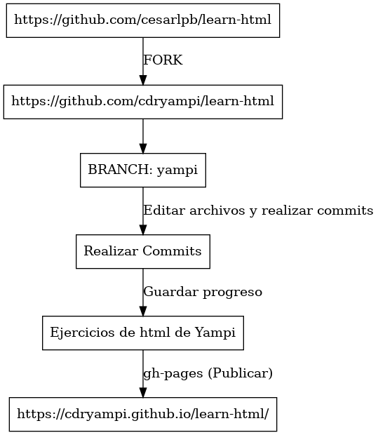

# 🌐 Learn HTML

Repositorio para aprender HTML desde cero con teoría, ejercicios prácticos y estilos modernos.

---

## 📚 Recursos de Aprendizaje

- **Teoría con ejemplos**: [w3schools](https://www.w3schools.com/html/default.asp)
- **Documentación oficial**: [MDN Web Docs](https://developer.mozilla.org/es/)
- **Compatibilidad de etiquetas**: [Can I Use](https://caniuse.com/)

---

## ✏️ Ejercicios

- [Ejercicios básicos en Auladiv](https://www.auladiv.com/ejercicios/html-basico/)

---

## ⚙️ Instalación de Tailwind CSS

### **Requisitos Previos**

1. Instalar [Node.js](https://nodejs.org/es/)

### **Pasos para Configurar Tailwind CSS**

1. **Instalar Tailwind CSS**

   ```bash
   npm install -D tailwindcss
   ```

2. **Crear Archivo de Configuración**

   ```bash
   npx tailwindcss init
   ```

3. **Configurar `tailwind.config.js`**

   ```js
   /** @type {import('tailwindcss').Config} */
   module.exports = {
     content: ["./*.{html,js}", "./ejercicios/*.{html,js}"],
     theme: {
       extend: {},
     },
     plugins: [],
   };
   ```

4. **Inicializar Tailwind CSS**
   ```bash
   npx tailwindcss -i ./src/css/styles.css -o ./src/css/output.css --watch
   ```

---

## 🚀 Publicar en GitHub Pages

### **Configuración del Workflow**

1. Crear el archivo `.github/workflows/gh-pages.yml`:

   ```yml
   name: Deploy to GitHub Pages with gh-pages

   on:
     push:
       branches:
         - main

   jobs:
     deploy:
       runs-on: ubuntu-latest
       steps:
         - name: Checkout Code
           uses: actions/checkout@v3

         - name: Setup Node.js
           uses: actions/setup-node@v3
           with:
             node-version: 18

         - name: Install Dependencies
           run: npm install

         - name: Build TailwindCSS
           run: npm run build

         - name: Deploy to GitHub Pages
           run: npm run deploy
           env:
             GITHUB_TOKEN: ${{ secrets.GITHUB_TOKEN }}
   ```

2. **Añadir scripts en `package.json`**:

   ```json
   {
     "devDependencies": {
       "gh-pages": "^6.3.0",
       "tailwindcss": "^3.4.17"
     },
     "scripts": {
       "build": "npx tailwindcss -i ./src/css/input.css -o ./public/output.css --minify",
       "deploy": "npm run build && gh-pages -d public"
     },
     "homepage": "https://tuusuario.github.io/learn-html"
   }
   ```

3. **Configurar `.gitignore`**

   ```plaintext
   node_modules
   ```

4. **Instalar `gh-pages`**

   ```bash
   npm install gh-pages

   ```

## 🌟 Enlace al Proyecto

¡Visita el proyecto en acción! [Learn HTML en GitHub Pages](https://cdryampi.github.io/learn-html)

---

## Workflow o cosmovisión del proyecto de como lo veo



## 🖼️ Vista Previa


## 🔧 Tecnologías Usadas

### 🖋️ **HTML**


### 🎨 **Tailwind CSS**


### 🛠️ **Git**


### ⚙️ **CI/CD**


